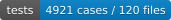

# n8n AI CLI Loop

A workflow template for queuing GitHub Issues and running local CLI agents sequentially from n8n.

> **Public mirror note:** This is a periodic, read-only snapshot mirror.
> Development happens on a private source-of-truth repository, and the
> automation loop itself runs only against that private repository —
> nothing on this mirror is processed automatically, and it does not accept
> issues or pull requests. This note is carried into the mirror
> automatically by the export described in
> [docs/copybara-public-export.md](docs/copybara-public-export.md) rather
> than edited on the mirror directly.

[](docs/metrics/latest.md)
[](docs/metrics/latest.md)
[](docs/metrics/latest.md)
[](docs/metrics/latest.md)

## New here? Start with the install guide

**[docs/install.md](docs/install.md)** walks a new operator from a fresh
checkout through a successful first run, covering prerequisites, `sessions.json`
configuration, workflow import order, and a smoke-test checklist.

> **Wondering whether a documented feature actually runs today?**
> **[docs/feature-status.md](docs/feature-status.md)** is the canonical,
> repository-wide status matrix — available, config-gated, foundation-only,
> or design-only — with evidence and known gaps for every major area.

> **Security note:** This system is designed for **private/internal** AI
> control planes. Do not use public GitHub Issues as the primary orchestration
> surface. See [docs/private-control-plane-security.md](docs/private-control-plane-security.md)
> for the full deployment boundary and security model.

---

The maintained workflow is the **parent/child split** (`docs/n8n-thin-child-workflow.json` + `docs/n8n-thin-parent-workflow.json`). The child runs the three CLI commands (`github-intake` → `run-one-phase` → `dispatch-outbox`); the parent holds triggers and session config. The workflow JSONs are generated from `scripts/build-parent-child-workflow.mjs`.

## What This Does

The parent/child workflow runs on a schedule (every 5 minutes) or on manual trigger. One n8n execution runs three CLI steps in sequence — intake, phase execution, and outbox dispatch. Main lanes:

- `agent:claude` + `status:needs-implementation`: Implement with Claude Code and create a PR
- `agent:claude` + `status:needs-fix`: Apply fixes to an existing PR
- `agent:codex` + `status:needs-review`: Review with Codex CLI
- `agent:gemini` + `status:research-needed`: Research with Antigravity/Gemini-based CLI
- `status:needs-conflict-resolution`: PR conflict resolution lane
- `status:backlog`: When no other work is pending, promote one item to the implementation queue

An advisory lock at `.n8n-artifacts/repo.lock` prevents concurrent runs against the same repository. Artifacts for each run are stored under `.n8n-artifacts/runs/<run-id>/`.

Each phase's responsibilities, prohibitions, and success/failure conditions are defined in `docs/phase-contracts.md`. The n8n workflow selects phases according to this contract, and the TypeScript handlers manage repository operations and state transitions.

## Built by Its Own Loop

n8n-ai-cli-loop is developed through n8n-ai-cli-loop itself.

As of 2026-07-08, roughly one month after active development began, the project had grown to:

- 40k+ lines of TypeScript source
- 3,200+ Jest test cases
- 190+ merged pull requests
- about $300 of AI runtime cost

Implementation, review, recovery, and workflow iteration are all driven through the same n8n-based AI development loop that this project provides. Current source and test counts are tracked in [docs/metrics/latest.md](docs/metrics/latest.md).

## Requirements

The target repository must have the following commands available:

- `node`
- `npm`
- `git`
- `gh`
- `claude`
- `codex`
- `agy` or the research CLI specified via `ANTIGRAVITY_BIN`

The GitHub CLI must be authenticated for the target repository. Start n8n from the root directory of the target repository. Commands in the workflow assume the current directory is the GitHub repository root.

## Development

Install dependencies:

```sh
npm install
```

Regenerate the parent/child workflow JSONs:

```sh
npm run build:parent-child-workflow
```

Build the TypeScript library and regenerate the workflow:

```sh
npm run build
```

Run tests:

```sh
npm test
```

`npm test` regenerates the parent/child workflow JSONs in its pretest step and verifies that the checked-in JSONs match generator output.

## Thin CLI entrypoint (run-one-phase)

`dist/cli/run-one-phase.js` is a thin CLI entrypoint called from n8n's Execute Command node. It keeps phase logic and heredocs out of the n8n workflow side, centralizing session configuration and task queue management entirely in TypeScript.

### Command format

```sh
node /path/to/n8n-ai-cli-loop/dist/cli/run-one-phase.js \
  --session-id "addon-dev" \
  --run-id "{{ $execution.id }}"
```

### Arguments

| Argument | Required | Default | Description |
|---|---|---|---|
| `--session-id` | ✓ | — | Session ID defined in sessions.json |
| `--run-id` | ✓ | — | Unique run ID such as the n8n execution ID |
| `--sessions-path` | | `~/.config/n8n-ai-cli-loop/sessions.json` | Path to the session definition JSON |
| `--db-path` | | `~/.config/n8n-ai-cli-loop/dev_loop.db` | Path to the SQLite task database |
| `--worker-id` | | `n8n-cli` | Worker identifier |

### Output (stdout)

Writes one line of JSON to stdout, which can be parsed directly by n8n's Execute Command node.

```json
{ "ok": true, "outcome": "idle", "sessionId": "addon-dev" }
{ "ok": true, "outcome": "phase_missing", "task": { "issueNumber": 134, "status": "ready_for_human", "phase": "implementation" }, ... }
{ "ok": true, "outcome": "completed", "task": { ... }, "result": "success", ... }
```

### Exit codes

- `0`: Normal exit (covers idle, phase_missing, completed, and claim_lost)
- `1`: Setup error (missing arguments, sessions.json not found, unknown sessionId)

### Session configuration (sessions.json)

Define sessions in `~/.config/n8n-ai-cli-loop/sessions.json` using the following format:

```json
{
  "sessions": [
    {
      "sessionId": "addon-dev",
      "repoKey": "thunderbird-auth-results-filter",
      "repoRoot": "/path/to/thunderbird-auth-results-filter",
      "githubRepo": "m2dw/thunderbird-auth-results-filter",
      "artifactDir": ".n8n-artifacts",
      "defaults": {
        "implementationAgent": "claude",
        "reviewAgent": "codex",
        "researchAgent": "gemini"
      },
      "verification": { "test": "npm test", "package": "npm run package" },
      "labels": {
        "active": "ai:active",
        "blocked": "ai:blocked",
        "readyForHuman": "ai:ready-for-human"
      }
    }
  ]
}
```

## enqueue-task CLI

`dist/cli/enqueue-task.js` inserts a task into the SQLite queue so `run-one-phase` can claim it.

### Command format

```sh
node /path/to/n8n-ai-cli-loop/dist/cli/enqueue-task.js \
  --session-id "addon-dev" \
  --issue-number 123 \
  --phase implementation \
  --implementation-agent claude \
  --review-agent codex
```

### Arguments

| Argument | Required | Default | Description |
|---|---|---|---|
| `--session-id` | ✓ | — | Session ID defined in sessions.json |
| `--issue-number` | ✓ | — | Positive integer (GitHub issue number) |
| `--phase` | ✓ | — | `implementation` / `review` / `conflict_resolution` / `research` / `planner` |
| `--sessions-path` | | `~/.config/n8n-ai-cli-loop/sessions.json` | Path to the session definition JSON |
| `--db-path` | | `~/.config/n8n-ai-cli-loop/dev_loop.db` | Path to the SQLite task database |
| `--priority` | | `normal` | `high` / `normal` / `low` |
| `--implementation-agent` | | session default | `claude` / `codex` / `gemini` |
| `--review-agent` | | session default | `claude` / `codex` / `gemini` |
| `--research-agent` | | session default | `claude` / `codex` / `gemini` |
| `--context-json` | | — | Additional context as a JSON object |

### Output examples

On success:
```json
{ "ok": true, "code": "enqueued", "task": { "sessionId": "addon-dev", "issueNumber": 123, "phase": "implementation", "status": "queued", "priority": "normal" } }
```

Duplicate (idempotent):
```json
{ "ok": false, "code": "already_exists", "task": { "sessionId": "addon-dev", "issueNumber": 123, "phase": "implementation", "status": "queued" } }
```

### Exit codes

- `0`: Successfully enqueued, or `already_exists` (idempotent)
- `1`: Argument error, validation error, or configuration error

## github-intake CLI

`dist/cli/github-intake.js` searches GitHub for open issues by label and enqueues matching issues into the SQLite task queue. Works in tandem with `run-one-phase`.

### Command format

```sh
node /path/to/n8n-ai-cli-loop/dist/cli/github-intake.js \
  --session-id "addon-dev"
```

### Arguments

| Argument | Required | Default | Description |
|---|---|---|---|
| `--session-id` | ✓ | — | Session ID defined in sessions.json |
| `--sessions-path` | | `~/.config/n8n-ai-cli-loop/sessions.json` | Path to the session definition JSON |
| `--db-path` | | `~/.config/n8n-ai-cli-loop/dev_loop.db` | Path to the SQLite task database |
| `--limit` | | `100` | Maximum number of issues to fetch from gh |
| `--dry-run` | | — | Report candidates without writing to SQLite |

### Label → Phase mapping

| GitHub label | Phase | Agent |
|---|---|---|
| `agent:claude` + `status:needs-implementation` | `implementation` | implementationAgent: claude |
| `agent:claude` + `status:needs-fix` | `implementation` | implementationAgent: claude |
| `agent:codex` + `status:needs-review` | `review` | reviewAgent: codex |
| `agent:gemini` + `status:research-needed` | `research` | researchAgent: gemini |
| `status:needs-conflict-resolution` | `conflict_resolution` | — |

### Output example

```json
{
  "ok": true,
  "sessionId": "addon-dev",
  "repo": "m2dw/thunderbird-auth-results-filter",
  "scanned": 15,
  "candidates": 3,
  "enqueued": 2,
  "alreadyExists": 1,
  "dryRun": false,
  "results": [
    { "issueNumber": 101, "action": "enqueued", "phase": "implementation" },
    { "issueNumber": 102, "action": "already_exists", "phase": "review" },
    { "issueNumber": 103, "action": "enqueued", "phase": "research" }
  ]
}
```

### Exit codes

- `0`: Normal completion (covers no candidates, enqueued, and alreadyExists)
- `1`: Argument error, configuration error, gh command failure, or unexpected error

## Files

- `scripts/build-parent-child-workflow.mjs`: parent/child workflow JSON generator
- `src/`: TypeScript library for state-store, atomic task transitions, and phase-dispatch logic
- `docs/n8n-thin-parent-workflow.json`: tracked **parent template** — stable, environment-independent (canonical CLI path), for review and onboarding
- `docs/n8n-thin-child-workflow.json`: tracked **child template** — stable, environment-independent (canonical CLI path), for review and onboarding
- `.n8n-artifacts/workflows/`: gitignored **local deployment artifacts** generated with your machine's `CLI_BASE` — one session-specific parent (`ai-dev-loop-parent-<slug>-<digest>.json`) plus the shared child; import these for a local deployment
- `test/*.test.js`: workflow and CLI contract tests

## Parent/Child Workflow

A two-workflow split where a stable parent orchestrates one thin worker child per
execution. The parent holds only triggers and session config; the child runs the three
CLI commands. Because the parent never changes when worker logic evolves, the
parent JSON can be treated as a stable artifact that does not need reimporting after
worker updates.

```
Parent: [Manual Trigger] ──┐
        [Schedule Trigger] ─┴──► [Config] ──► [Call Phase Runner]
                                                        │
                                              executes child workflow
                                                        │
Child:  [When Called by Parent] ──► [GitHub Intake]
                                             │
                                     [Run One Phase]
                                             │
                                     [Dispatch Outbox]
```

The generator writes two copies of each workflow (issue #391):

- **Tracked templates** under `docs/` — baked with the canonical CLI path
  (`/opt/n8n-ai-cli-loop/dist/cli`). These are stable, environment-independent,
  and safe to commit; they are for review and onboarding. A local `CLI_BASE`
  never dirties them.
- **Local deployment artifacts** under `.n8n-artifacts/workflows/` (gitignored) —
  baked with your machine's resolved `CLI_BASE`. **Import these for a local
  deployment**, since they carry the correct `dist/cli` path for your tree.

```sh
# Bakes your local CLI path into .n8n-artifacts/workflows/ (and refreshes docs/ templates)
npm run build:parent-child-workflow
# Or target a specific install:
CLI_BASE=/your/path/dist/cli npm run build:parent-child-workflow
```

For a local, same-host n8n the supported way to deploy is one command, which
generates this session's artifacts, imports them in the required order, verifies
what landed, and publishes only when explicitly asked. A parent that was already
active is re-activated after the import, so re-deploying never takes a running
session down:

```sh
node dist/cli/admin.js n8n deploy --session-ref my-project        # preview
node dist/cli/admin.js n8n deploy --session-ref my-project --yes  # apply
```

The n8n CLI writes n8n's database, and n8n loads its workflows at startup — so
**restart n8n after applying** if it was already running, or the imported
workflows and the parent's active state are not yet in effect. The command says
so whenever it wrote anything (`restartRequired` in `--json`).

See [docs/install.md](docs/install.md#7-generate-and-import-the-n8n-workflows)
for prerequisites and options. To import by hand instead:

Import order matters — child first so n8n registers its stable ID before the parent
resolves it. For a local deployment import from `.n8n-artifacts/workflows/`; the
`docs/` copies (`docs/n8n-thin-child-workflow.json`, `docs/n8n-thin-parent-workflow.json`)
are the same structure with the canonical placeholder path:

1. Import the **child workflow** (`n8n-thin-child-workflow.json`, id: `ai-dev-loop-thin-phase-runner`) — once, shared by every session
2. Import the session's **parent workflow** (`ai-dev-loop-parent-<slug>-<digest>.json` locally, id: the same derived string; `n8n-thin-parent-workflow.json`, id: `ai-dev-loop-thin-parent`, for the generic `docs/` template)

The parent's **Call Phase Runner** node references the child by its stable string ID
(`ai-dev-loop-thin-phase-runner`).

Each session gets its own parent: the workflow ID and name are derived from the
canonical `sessionId` (resolved from `SESSION_REF` through `sessions.json` at
generation time), and the Config node carries that canonical `sessionId`. The
child is session-agnostic — it receives only `contextId` — so all parents share
the one child workflow.

```sh
# One parent per session, all pointing at the same child:
SESSION_REF=my-project,other-project npm run build:parent-child-workflow
```

Import guide, smoke-test checklist, and operational reference (sessions.json, SQLite inspection, artifact paths):
👉 **[docs/parent-child-workflow.md](docs/parent-child-workflow.md)**

For a detailed CLI output reference and SQLite inspection commands, see the archived flat-workflow guide:
[docs/archive/minimal-self-driving.md](docs/archive/minimal-self-driving.md)

End-to-end walkthrough — from writing a GitHub issue to having a PR ready for
human review. Covers the `ai/issue-<N>` branch convention, `ai:ready-for-human`
label, what each automation phase does, the fix/review cycle, and when to
intervene manually:
👉 **[docs/idea-to-implementation.md](docs/idea-to-implementation.md)**

The equivalent operator guide for the content pipeline (content request →
research → draft → editorial review → the fixed `ready_for_human` handoff)
is specified in
[docs/content-human-ready-handoff.md](docs/content-human-ready-handoff.md).
Automated publication is explicitly out of scope — every export decision is
manual.

The contract for Tool Request handoff (what an agent does when it needs a
command outside its allowed tool set) and handler-owned dependency sync
(regenerating lockfiles without broadening agent permissions) is specified in
[docs/tool-request-and-dependency-sync.md](docs/tool-request-and-dependency-sync.md).

Future refactoring directions are summarized in [docs/future-architecture.md](docs/future-architecture.md).

Configurable agent assignment (which agent handles implementation, review, and
conflict resolution per flow) is specified in
[docs/assignment-profiles.md](docs/assignment-profiles.md).

Running AI work from a private Gitea work-item backend while keeping the public
GitHub issue/release repo clean is specified in
[docs/gitea-private-work-items.md](docs/gitea-private-work-items.md), and the
one-way import of a public GitHub issue into a private Gitea work item (without
leaking AI chatter back to public GitHub) is specified in
[docs/github-to-gitea-import.md](docs/github-to-gitea-import.md).
